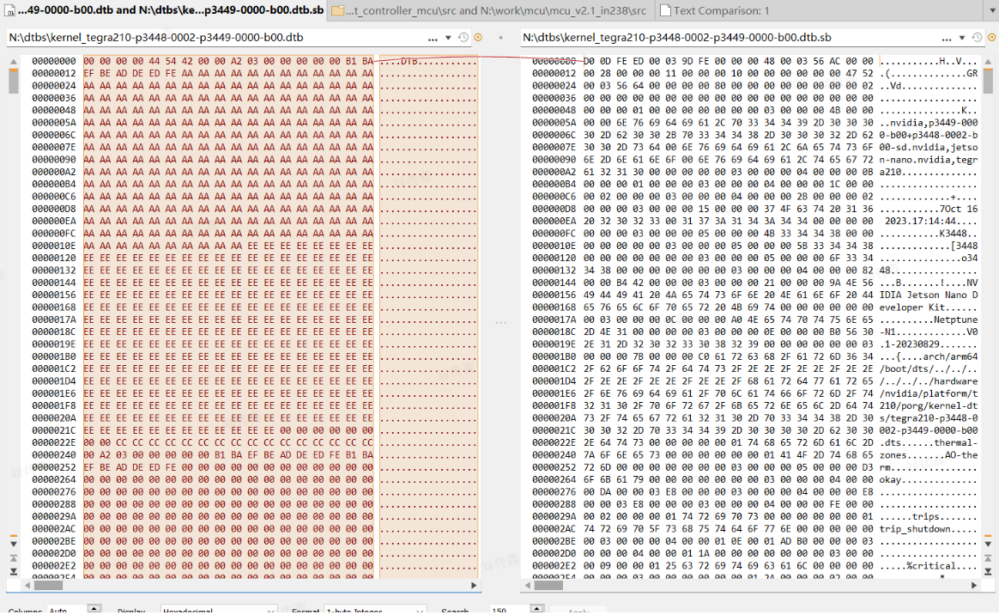
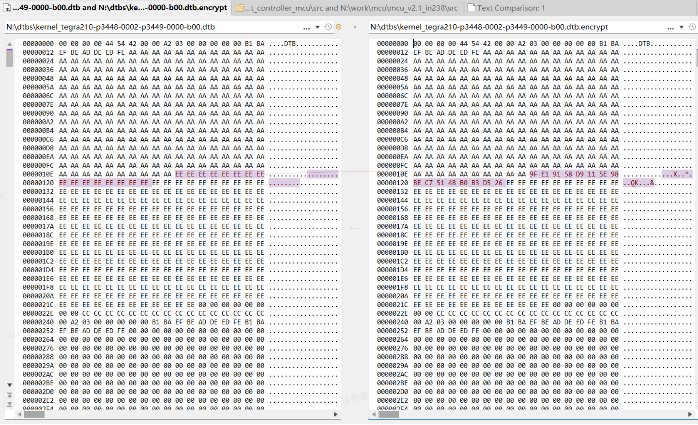

### 使用哪里的DTB？


BOOT在加载内核时, 通过读取 `/boot/extlinux/extlinux.conf` 这个文件，如果这个文件的引导规则中，没有指定FDT，将默认使用分区中的DTB（通过命令烧录到设备中的）。


```sh 
U-Boot 2020.04-g4335beb (Nov 22 2022 - 09:21:37 -0800)

SoC: tegra210
Model: NVIDIA Jetson Nano Developer Kit
Board: NVIDIA P3450-0000
DRAM:  4 GiB
MMC:   sdhci@700b0000: 1, sdhci@700b0600: 0
Loading Environment from MMC... *** Warning - bad CRC, using default environment

Out:   serial
Err:   serial
Net:   No ethernet found.
Hit any key to stop autoboot:  0 
MMC: no card present
switch to partitions #0, OK
mmc0(part 0) is current device
Scanning mmc 0:1...
Found /boot/extlinux/extlinux.conf
Retrieving file: /boot/extlinux/extlinux.conf
879 bytes read in 22 ms (38.1 KiB/s)
1:      primary kernel
Retrieving file: /boot/initrd
7160134 bytes read in 179 ms (38.1 MiB/s)
Retrieving file: /boot/Image
34629640 bytes read in 784 ms (42.1 MiB/s)
append: tegraid=21.1.2.0.0 ddr_die=4096M@2048M section=512M memtype=0 vpr_resize usb_port_owner_info=0 lane_owner_info=0 emc_max_dvfs=0 touch_id=0@63 video=tegrafb no_console_suspend=1 console=ttyS0,115200n8 debug_uartport=lsport,4 earlyprintk=uart8250-32bit,0x70006000 maxcpus=4 usbcore.old_scheme_first=1 lp0_vec=0x1000@0xff780000 core_edp_mv=1125 core_edp_ma=4000 gpt  earlycon=uart8250,mmio32,0x70006000  root=/dev/mmcblk0p1 rw rootwait rootfstype=ext4 console=ttyS0,115200n8 console=tty0 fbcon=map:0 net.ifnames=0 sdhci_tegra.en_boot_part_access=1 quiet root=/dev/mmcblk0p1 rw rootwait rootfstype=ext4 console=ttyS0,115200n8 console=tty0 fbcon=map:0 net.ifnames=0 sdhci_tegra.en_boot_part_access=1 
## Flattened Device Tree blob at 83100000
   Booting using the fdt blob at 0x83100000

```

如果通过文件指定了DTB文件，启动信息如下：

```sh 
U-Boot 2020.04-g4335beb (Nov 22 2022 - 09:21:37 -0800)

SoC: tegra210
Model: NVIDIA Jetson Nano Developer Kit
Board: NVIDIA P3450-0000
DRAM:  4 GiB
MMC:   sdhci@700b0000: 1, sdhci@700b0600: 0
Loading Environment from MMC... *** Warning - bad CRC, using default environment

In:    serial
Out:   serial
Err:   serial
Net:   No ethernet found.
Hit any key to stop autoboot:  0 
MMC: no card present
switch to partitions #0, OK
mmc0(part 0) is current device
Scanning mmc 0:1...
Found /boot/extlinux/extlinux.conf
Retrieving file: /boot/extlinux/extlinux.conf
951 bytes read in 23 ms (40 KiB/s)
1:      primary kernel
Retrieving file: /boot/initrd
7160134 bytes read in 179 ms (38.1 MiB/s)
Retrieving file: /boot/Image
34629640 bytes read in 784 ms (42.1 MiB/s)
append: tegraid=21.1.2.0.0 ddr_die=4096M@2048M section=512M memtype=0 vpr_resize usb_port_owner_info=0 lane_owner_info=0 emc_max_dvfs=0 touch_id=0@63 video=tegrafb no_console_suspend=1 console=ttyS0,115200n8 debug_uartport=lsport,4 earlyprintk=uart8250-32bit,0x70006000 maxcpus=4 usbcore.old_scheme_first=1 lp0_vec=0x1000@0xff780000 core_edp_mv=1125 core_edp_ma=4000 gpt  earlycon=uart8250,mmio32,0x70006000  root=/dev/mmcblk0p1 rw rootwait rootfstype=ext4 console=ttyS0,115200n8 console=tty0 fbcon=map:0 net.ifnames=0 sdhci_tegra.en_boot_part_access=1 quiet root=/dev/mmcblk0p1 rw rootwait rootfstype=ext4 console=ttyS0,115200n8 console=tty0 fbcon=map:0 net.ifnames=0 sdhci_tegra.en_boot_part_access=1 
Retrieving file: /boot/kernel_tegra210-p3448-0002-p3449-0000-b00_neptune.dtb
238080 bytes read in 32 ms (7.1 MiB/s)

```

### DTB文件 

在Nano的SDK开发环境中:

kernel/dtb/tegra210-p3448-0002-p3449-0000-b00.dtb  ce1c3fdde9512eec9319883921817b91 

bootloader/kernel_tegra210-p3448-0002-p3449-0000-b00.dtb  e4b8b0247b634d17c6d039244dd31a6b  
bootloader/kernel_tegra210-p3448-0002-p3449-0000-b00.dtb.sb  ce1c3fdde9512eec9319883921817b91 
bootloader/signed/kernel_tegra210-p3448-0002-p3449-0000-b00.dtb.encrypt  602862821c0c15330c1045a418e16573

由MD5计算后：
kernel/dtb/tegra210-p3448-0002-p3449-0000-b00.dtb 跟 bootloader/kernel_tegra210-p3448-0002-p3449-0000-b00.dtb.sb 一样的， 都是通过dtc命令直接生成的。

bootloader/kernel_tegra210-p3448-0002-p3449-0000-b00.dtb 比原始DTB文件多了一个头部




bootloader/signed/kernel_tegra210-p3448-0002-p3449-0000-b00.dtb.encrypt 比 bootloader/kernel_tegra210-p3448-0002-p3449-0000-b00.dtb 文件多了一个签名校验码




那么在设备/boot目录的下的dtb文件，具体是指哪个呢，通过比较发现，/boot目录中的文件即为原始dtc编译的文件。

